# GRPC vs. REST Benchmarking

This repository is created to see the performance measurements of a gRPC and REST API.

For these purposes, a gRPC and a REST endpoint is created.

In these tests, different amount of Benchmark object payload below is returned from the endpoints.

```
[
    {
        "id": "1",
        "title": "title",
        "detail": {
        "id": "1",
        "title": "title",
        "description": "description"
        }
    }
]
```

## Run the Project

To run the project

```
make run
```

To make clean & install

```
make install
```

To try proto vs. json

```
make proto-vs-json
```

## Run the Tests

You can run the tests with ```jmeter``` using the ```.jmx``` files under directory of ```jmeter/jmx```

Before trying to run the tests, please install jmeter and ```jmeter-grpc-request``` in this [repository](https://github.com/zalopay-oss/jmeter-grpc-request) and in this repository [example](https://github.com/zalopay-oss/jmeter-grpc-request/tree/master/dist/example)

To run any test after the installments

For local tests:

```
make load-test testfile=jmeter/jmx/local/rest/1-rest.jmx
```

For ec2 tests, run the application in a ec2 or any remote machine and enter the ip address of machine to .jmx file

```
make load-test testfile=jmeter/jmx/ec2/grpc/1-grpc.jmx
```

Or you can open Apache-JMeter GUI and give the test configurations yourself.


## Load Test Trials

### Trial Details
- 10 users sending 1000 request in total concurrently.
- Used ```jmeter``` for load testing.
- Used ```local``` and ```ec2``` environment.

### Trial 1 - (1 payload)
#### ec2
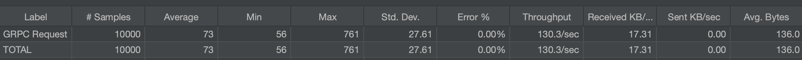


#### Local
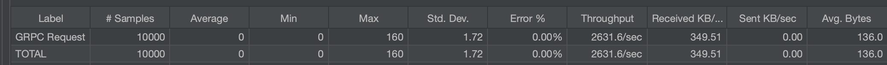

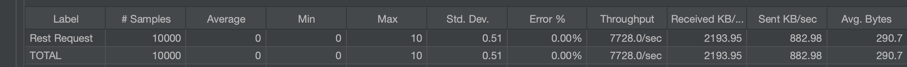

### Trial 2 - (10 payloads)
#### ec2
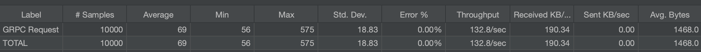

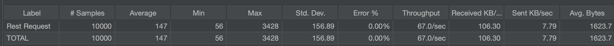

#### Local
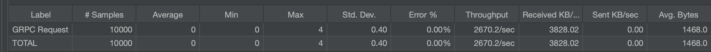

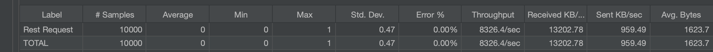

### Trial 3 - (100 payloads)
#### ec2
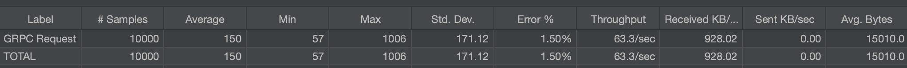

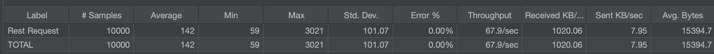

#### Local
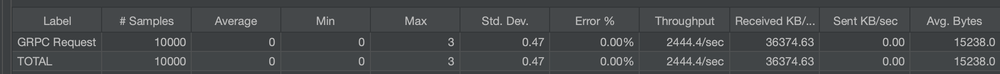

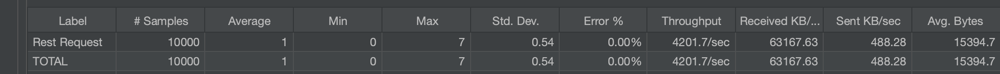

### Trial 4 - (1000 payloads)
#### ec2
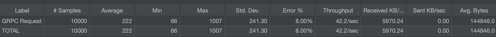

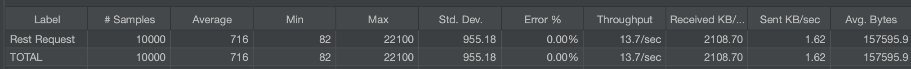

#### Local
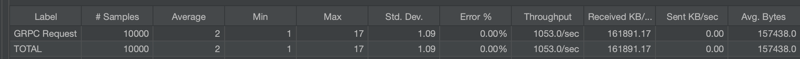

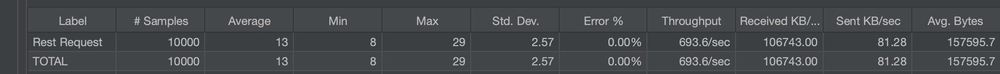

## Protobuf vs. JSON

In gRPC, as a message format ```protocol buffers``` is used. In a separate endpoint, JSON and protocol buffers performance is measured. For further benchmarks see this [repository](https://github.com/brunokrebs/auth0-speed-test). Below is an analyze that is run in local 10 times to measure the performance gap between ```application/x-protobuf``` and ```application/json```

```
    % Total    % Received % Xferd  Average Speed   Time    Time     Time  Current
    Dload  Upload   Total   Spent    Left  Speed
    100    50    0    50    0     0      4      0 --:--:--  0:00:10 --:--:--    12
        {
        "protobufAverage": "43 ms",
        "jsonAverage": "823 ms"
        }
```


